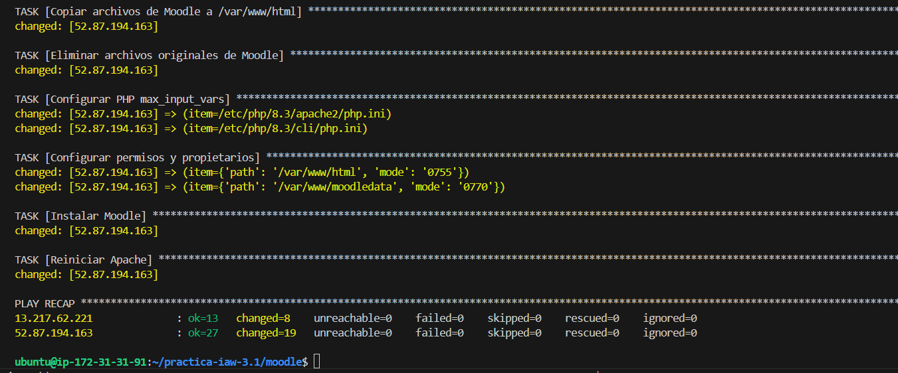
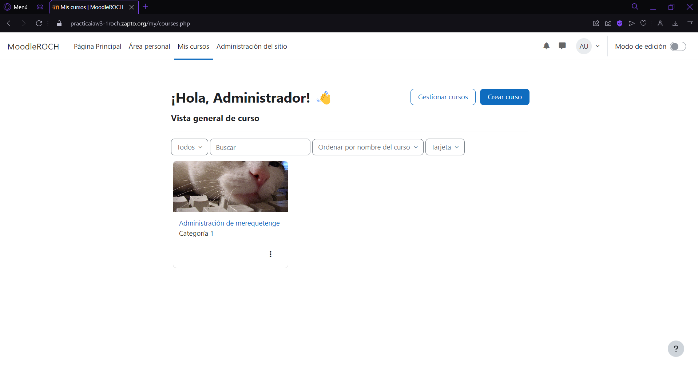
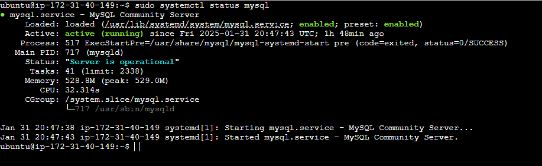
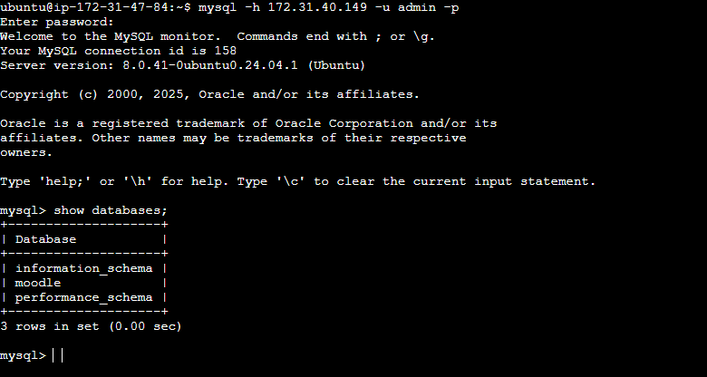
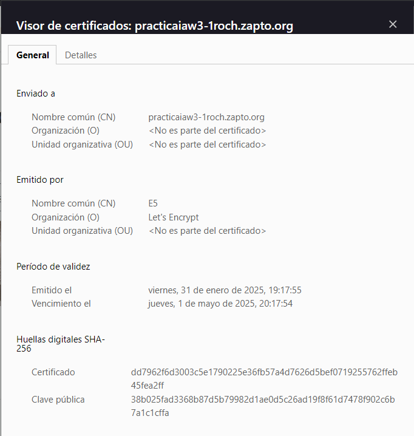

# Practica IAW 3.1 

## Implantación de Moodle en Amazon Web Services (AWS) mediante Ansible

En esta practica vamos a realizar la implantación de Moodle a traves de una plataforma de computacion en la nube mediante **Ansible**, en este caso usaremos Amazon Web Services (AWS) como plataforma. Vamos a partir de la base de la [`Practica 1.8 - Implantación de Moodle en Amazon Web Services (AWS)`](https://github.com/rcazhui1404/practica-iaw-1.8).

## Infraestructura necesaria

La infraestructura propuesta consta de dos máquinas virtuales, una **front-end**  formada por un servidor web con Apache HTTP Server y una capa de **back-end** formada por un servidor MySQL.

## Estructura de la práctica

La estrutura que va tener esta practiva a ser la siguiente:

```bash
.
├── README.md
├── templates
│   └── 000-default.conf
└── inventory
│   └── inventory
└── playbooks
│   ├── setup_letsencrypt_https.yml
│   ├── install_lamp_backend.yml
│   ├── install_lamp_frontend.yml
│   ├── deploy_backend.yml
│   └── deploy_frontend.yml
└── vars
│   └── variables.yml
└── main.yml
```

### Contenido de los directorios

- El directorio templates tendra el archivo de configuracion `000-default.conf` con el siguiente contenido.

```bash
ServerSignature Off
ServerTokens Prod

<VirtualHost *:80>
        DocumentRoot /var/www/html
        DirectoryIndex index.php index.html

        ErrorLog ${APACHE_LOG_DIR}/error.log
        CustomLog ${APACHE_LOG_DIR}/access.log combined

        <Directory "/var/www/html">
            AllowOverride All
        </Directory>
</VirtualHost>
```

- El directorio inventory tendra el archivo **inventory** con los datos de los grupos con sus respectivas ips elasticas y las variables con los datos necesarios para poder hacer ssh.

```bash
[frontend]
44.209.220.152

[backend]
50.17.148.42

[all:vars]
ansible_user=ubuntu
ansible_ssh_private_key_file=/home/ubuntu/practica-iaw-3.1/vockey.pem
ansible_ssh_common_args='-o StrictHostKeyChecking=accept-new'
```

- El directorio playbooks consta de cinco ficheros de Ansible con la configuracion necesaria para poder desplegar moodle, estos cinco ficheros son:
    
    - install_lamp_frontend.yml
    - install_lamp_backend.yml
    - deploy_backend.yml
    - setup_letsencrypt_https.yml
    - deploy_frontend.yml

- Dentro del directorio vars almacenamos el archvivo de variables de `Ansible`.

- Dentro del fichero `main.yml` importamos los playbooks mencionados previamente para poder realizar un despliegue.

## Contenido del install_lamp_frontend

Actualizamos la lista de paquetes para asegurarnos de que los paquetes disponibles estén actualizados.

```bash
    - name: Actualizar lista de paquetes
      apt:
        update_cache: yes
```

Actualizamos los paquetes instalados para mantener el sistema al día y eliminar paquetes innecesarios.

```bash
    - name: Actualizar paquetes
      apt:
        upgrade: dist
        autoremove: yes
```

Instalamos Apache.

```bash
    - name: Instalar Apache
      apt:
        name: apache2
        state: present
```

Habilitamos el módulo rewrite en Apache para permitir la reescritura de URLs.

```bash
    - name: Habilitar módulo rewrite en Apache
      command: a2enmod rewrite
      notify: Reiniciar Apache
```

Copiamos el archivo de configuración de Apache desde una plantilla predefinida.

```bash
    - name: Copiar archivo de configuración de Apache
      copy:
        src: /home/ubuntu/practica-iaw-3.1/moodle/templates/000-default.conf
        dest: /etc/apache2/sites-available/000-default.conf
        owner: root
        group: root
        mode: '0644'
      notify: Reiniciar Apache
```

Instalamos PHP y los módulos requeridos para permitir la ejecución de aplicaciones PHP.

```bash
    - name: Instalar PHP y módulos requeridos
      apt:
        name:
          - php
          - libapache2-mod-php
          - php-mysql
          - php-xml
          - php-mbstring
          - php-curl
          - php-zip
          - php-gd
          - php-intl
          - php-soap
          - php-mysqli
        state: present
```

Reiniciamos de Apache para aplicar los cambios de configuración.

```bash
    - name: Reiniciar Apache
      systemd:
        name: apache2
        state: restarted
```

Eliminamos instalaciones previas de Moodle para evitar conflictos con configuraciones anteriores.

```bash
    - name: Eliminar instalaciones previas de Moodle
      file:
        path: /var/www/moodledata
        state: absent
```

Creamos el directorio moodledata con los permisos adecuados para Moodle.

```bash
    - name: Crear directorio moodledata
      file:
        path: /var/www/moodledata
        state: directory
        owner: www-data
        group: www-data
        mode: '0755'
```

Modificamos permisos y propietario del directorio web para garantizar el correcto acceso a los archivos.

```bash
    - name: Modificar propietario y grupo de /var/www/html
      file:
        path: /var/www/html
        state: directory
        owner: www-data
        group: www-data
        recurse: yes
```

## Contenido del install_lamp_backend

Instalamos el módulo pymysqlste que permite que Ansible gestione bases de datos MySQL de manera programática.

```bash
    - name: Instalamos el módulo de pymysql
      apt:
        name: python3-pymysql
        state: present
```

Se actualiza la lista de paquetes disponibles en el repositorio.

```bash
    - name: Actualizar lista de paquetes
      apt:
        update_cache: yes
```

Se actualizan los paquetes existentes y se eliminan los que ya no son necesarios.

```bash
    - name: Actualizar paquetes
      apt:
        upgrade: dist
        autoremove: yes
```

Se instala MySQL Server en el servidor remoto.

```bash
    - name: Instalar MySQL Server
      apt:
        name: mysql-server
        state: present
```

Se edita el archivo de configuración de MySQL para permitir conexiones desde cualquier dirección IP, en lugar de restringirlas a 127.0.0.1.

```bash
    - name: Configurar MySQL para aceptar conexiones remotas
      replace:
        path: /etc/mysql/mysql.conf.d/mysqld.cnf
        regexp: '127.0.0.1'
        replace: '0.0.0.0'
```

Se reinicia MySQL para aplicar los cambios realizados en la configuración.

```bash
    - name: Reiniciar servicio MySQL
      systemd:
        name: mysql
        state: restarted
```

## Contenido del deploy_backend

Si una base de datos con el mismo nombre ya existe, se elimina para garantizar una configuración limpia.

```bash
    - name: Eliminar base de datos existente si existe
      mysql_db:
        name: "{{ db.name }}"
        state: absent
        login_unix_socket: /var/run/mysqld/mysqld.sock
```

Se crea una nueva base de datos con el nombre especificado en variables.yml.

```bash
    - name: Crear nueva base de datos para Moodle
      mysql_db:
        name: "{{ db.name }}"
        state: present
        login_unix_socket: /var/run/mysqld/mysqld.sock 
```

Si el usuario de la base de datos ya existe, se elimina antes de crearlo nuevamente.

```bash
    - name: Eliminar usuario de base de datos si existe
      mysql_user:
        name: "{{ db.user }}"
        host: "{{ frontend_private_ip }}"
        state: absent
        login_unix_socket: /var/run/mysqld/mysqld.sock 
```

Se crea un nuevo usuario para la base de datos de Moodle, con acceso desde cualquier dirección IP y con todos los privilegios sobre la base de datos.

```bash
    - name: Crear usuario de base de datos para Moodle
      mysql_user:
        name: "{{ db.user }}"
        password: "{{ db.password }}"
        host: "%"
        priv: "{{ db.name }}.*:ALL"
        state: present
        login_unix_socket: /var/run/mysqld/mysqld.sock 
```

## Contenido del setup_letsencrypt_https

Si Certbot fue instalado anteriormente con apt, esta tarea lo elimina para evitar conflictos con la versión instalada mediante snap.

```bash
    - name: Desinstalar instalaciones previas de Certbot
      apt:
        name: certbot
        state: absent
```

Se instala Certbot utilizando Snap, asegurando que se obtiene la versión más reciente y compatible con Let's Encrypt.

```bash
    - name: Instalar Certbot con snap
      snap:
        name: certbot
        classic: yes
        state: present
```

Se solicita y configura el certificado SSL/TLS.

```bash
    - name: Solicitar y configurar certificado SSL/TLS a Let's Encrypt con certbot
      command:
        certbot --apache \
        -m {{ certbot.email }} \
        --agree-tos \
        --no-eff-email \
        --non-interactive \
        -d {{ certbot.domain }}
```

## Contenido del deploy_frontend

Se elimina cualquier versión previa del archivo de instalación de Moodle en `/tmp`.

```bash
    - name: Eliminar instalaciones previas
      file:
        path: /tmp/moodle-latest-405.tgz*
        state: absent
```

Se descarga la última versión estable de Moodle desde su sitio oficial.

```bash
    - name: Descargar código fuente de Moodle
      get_url:
        url: https://download.moodle.org/download.php/direct/stable405/moodle-latest-405.tgz
        dest: /tmp/moodle-latest-405.tgz
```

Se extrae los archivos de Moodle en el directorio temporal `/tmp`.

```bash
    - name: Descomprimir código fuente de Moodle
      unarchive:
        src: /tmp/moodle-latest-405.tgz
        dest: /tmp
        remote_src: yes
```

Se elimina cualquier instalación anterior de Moodle en el directorio web.

```bash
    - name: Eliminar contenido previo en /var/www/html
      file:
        path: /var/www/html
        state: absent

```

Movemos los archivos de Moodle al directorio `/var/www/html`.

```bash
    - name: Copiar archivos de Moodle a /var/www/html
      copy:
        src: /tmp/moodle/
        dest: /var/www/html/
        remote_src: yes
```

Borramos los archivos extraídos en `/tmp` para liberar espacio.

```bash
    - name: Eliminar archivos originales de Moodle
      file:
        path: /tmp/moodle/
        state: absent
```

Modificamos la configuración de PHP para aumentar el límite de `max_input_vars` requerido por Moodle.

```bash
    - name: Configurar PHP max_input_vars
      replace:
        path: "{{ item }}"
        regexp: ';max_input_vars = 1000'
        replace: 'max_input_vars = 5000'
      loop: "{{ php_config_files }}"
```

Aseguramos que el servidor web tiene los permisos adecuados sobre los archivos de Moodle.

```bash
    - name: Configurar permisos y propietarios
      file:
        path: "{{ item.path }}"
        owner: www-data
        group: www-data
        mode: "{{ item.mode }}"
        recurse: yes
      loop: "{{ moodle_permisos }}"
```

Ejecutamos el script de instalación de Moodle con los parámetros definidos en el archivo de variables.

```bash
    - name: Instalar Moodle
      command: >
        sudo -u www-data /usr/bin/php /var/www/html/admin/cli/install.php --lang={{ moodle.idioma }} --wwwroot={{ moodle.url }} --dataroot={{ moodle.directorydata }} --dbtype={{ moodle.tipobd }} --dbhost={{ moodle.host }} --dbname={{ moodle.name }} --dbuser={{ moodle.user }} --dbpass={{ moodle.pass }} --prefix={{ moodle.prefijo }} --fullname="{{ moodle.fullname }}" --shortname={{ moodle.shortname }} --summary="{{ moodle.summary }}" --adminuser={{ moodle.admin }} --adminpass={{ moodle.adminpass }} --adminemail={{ moodle.adminemail }} --agree-license --non-interactive
```

Reiniciamos Apache para aplicar los cambios en la configuración.

```bash
    - name: Reiniciar Apache
      systemd:
        name: apache2
        state: restarted
```

## Comprobaciones

Comprobación de que se ejecuta sin ningun problema.



Comprobación del funcionamiento de Moodle.



Comprobación del estado del MySQL.



Comprobación de que la maquina front-end tiene acceso a mysql.



Comprobación del certificado SSL/TLS.

