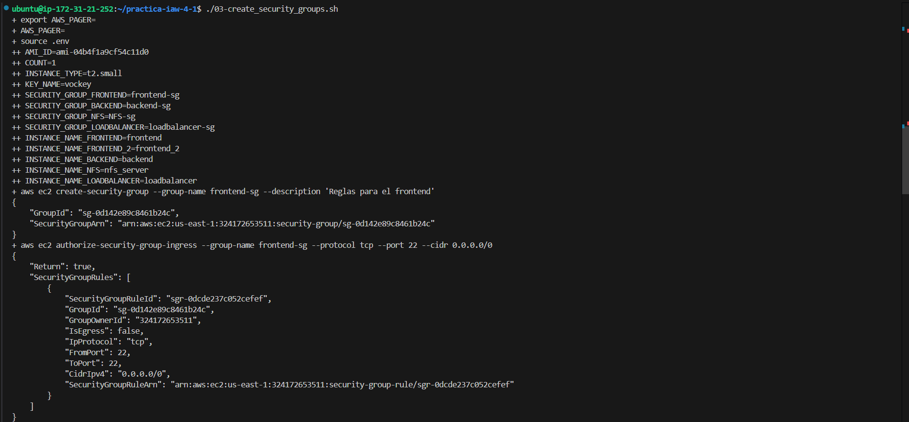
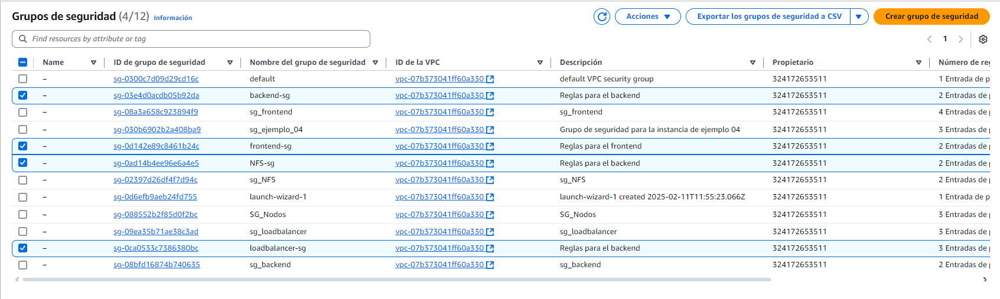
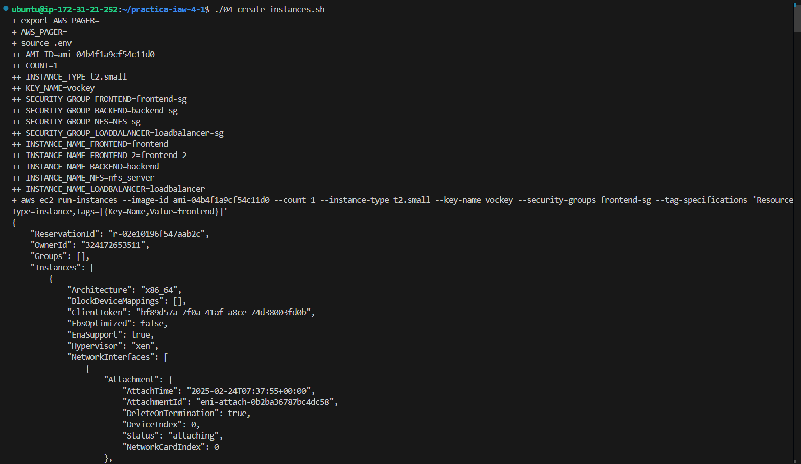
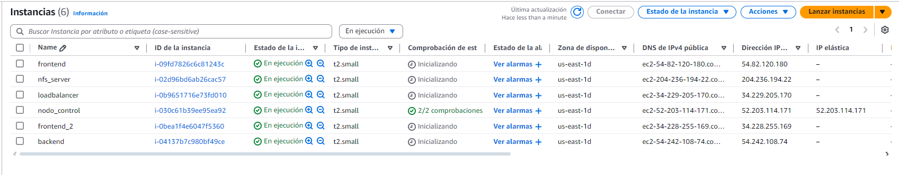

# Practica IAW 4.1 

## Implantación de Wordpress en AWS utilizando una arquitectura de tres niveles con AWS CLI

En esta practica vamos a realizar la creacion de la estructura de la [`Practica 1.11 - Implantación de Wordpress en AWS utilizando una arquitectura de tres niveles`](https://github.com/rcazhui1404/practica-iaw-1.11) a traves de una plataforma de computacion en la nube mediante **AWS CLI**.

## ¿Qué es AWS CLI?

[`AWS CLI (Command Line Interface)`](https://docs.aws.amazon.com/es_es/cli/) es una herramienta que se ejecuta desde la línea de comandos que permite gestionar todos los servicios de Amazon Web Services.

[`AWS CLI`](https://docs.aws.amazon.com/es_es/cli/) proporciona acceso directo a la API pública de los servicios de AWS, de forma que todas las funcionalidades que se pueden realizar desde la consola de admnistración web, también se pueden realizar con esta herramienta desde la línea de comandos.

Esta herramienta nos permite crear scripts de shell para automatizar la creación y la administración de los servicios de AWS.

## Infraestructura necesaria

La infraestructura propuesta consta de cinco máquinas virtuales, un **balanceador de carga**, una capa **front-end** formada por dos servidores web y un servidor NFS y una ultima capa **back-end** formada por un servidor, cada capa de la infraestrutura tendra su respectivo grupo de seguridad con reglas personalizadas.

Necesitaremos crear las siguientes máquinas virtuales y reglas:

- Balanceador: Acceso por SSH (puerto 22), HTTP (puerto 80) y HTTPS (puerto 443).
- Frontal Web 1: Acceso por SSH (puerto 22) y NFS (puerto 2049).
- Frontal Web 2: Acceso por SSH (puerto 22) y NFS (puerto 2049).
- Servidor NFS: NFS: Acceso por SSH (puerto 22) y NFS (puerto 2049).
- Servidor de Base de Datos: Acceso por SSH (puerto 22) y MySQL (puerto 3306).

## Paso previos a la práctica

### Instalación de AWS CLI

Para realizar la instalación de AWS CLI en un sistema operativo Linux sobre una arquitectura x86 de 64 bits, tenemos que ejecutar los siguientes comandos.

**Paso 1.** Descargamos un archivo `.zip` con la aplicación AWS CLI.

```bash
curl "https://awscli.amazonaws.com/awscli-exe-linux-x86_64.zip" -o "awscliv2.zip"
```

**Paso 2.** Descomprimimos el archivo que acabamos de descargar.

```bash
unzip awscliv2.zip
```

**Paso 3.** Ejectuamos el script de instalación.

```bash
sudo ./aws/install
```

**Paso 4.** Comprobamos que la instalación se ha realizado de forma correcta.

```bash
aws --version
```

### Configuración de AWS CLI

Para configurar AWS CLI ejecutaremos el siguiente comando.

```bash
aws configure
```

Este comandos nos preguntará estos datos:

```bash
AWS Access Key ID [None]: 
AWS Secret Access Key [None]: 
Default region name [None]: 
Default output format [None]:
``` 

Y creará un archivo de texto llamado credentials dentro del directorio home del usuario.

- En Linux/macOs el archivo estará en la ruta: `~/.aws/credentials`.
- En Windows estará en la ruta: `C:\Users\usuario\.aws\credentials`.


## Creación y configuracion de grupos de seguridad

Deshabilitamos la paginación de la salida de los comandos de `AWS CLI`

```bash
export AWS_PAGER=""
```

Importamos las variables de entorno

```bash
source .env
```

### Creamos el grupo de seguridad: frontend-sg

Ejecutamos el siguiente comando para crear un nuevo grupo de seguridad.

```bash
aws ec2 create-security-group \
    --group-name $SECURITY_GROUP_FRONTEND \
    --description "Reglas para el frontend"
```

Creamos una regla de accesso SSH

```bash
aws ec2 authorize-security-group-ingress \
    --group-name $SECURITY_GROUP_FRONTEND \
    --protocol tcp \
    --port 22 \
    --cidr 0.0.0.0/0
```

Creamos una regla de accesso para NFS

```bash
aws ec2 authorize-security-group-ingress \
    --group-name $SECURITY_GROUP_FRONTEND \
    --protocol tcp \
    --port 2049 \
    --cidr 0.0.0.0/0
```

### Creamos el grupo de seguridad: backend-sg

Ejecutamos el siguiente comando para crear un nuevo grupo de seguridad.

```bash
aws ec2 create-security-group \
    --group-name $SECURITY_GROUP_BACKEND \
    --description "Reglas para el backend"
```

Creamos una regla de accesso SSH

```bash
aws ec2 authorize-security-group-ingress \
    --group-name $SECURITY_GROUP_BACKEND \
    --protocol tcp \
    --port 22 \
    --cidr 0.0.0.0/0
```

Creamos una regla de accesso para MySQL

```bash
aws ec2 authorize-security-group-ingress \
    --group-name $SECURITY_GROUP_BACKEND \
    --protocol tcp \
    --port 3306 \
    --cidr 0.0.0.0/0
```


### Creamos el grupo de seguridad: NFS-sg

Ejecutamos el siguiente comando para crear un nuevo grupo de seguridad.

```bash
aws ec2 create-security-group \
    --group-name $SECURITY_GROUP_NFS \
    --description "Reglas para el backend"
```

Creamos una regla de accesso SSH

```bash
aws ec2 authorize-security-group-ingress \
    --group-name $SECURITY_GROUP_NFS \
    --protocol tcp \
    --port 22 \
    --cidr 0.0.0.0/0
```

Creamos una regla de accesso para NFS

```bash
aws ec2 authorize-security-group-ingress \
    --group-name $SECURITY_GROUP_NFS \
    --protocol tcp \
    --port 2049 \
    --cidr 0.0.0.0/0
```

### Creamos el grupo de seguridad: loadbalancer-sg

Ejecutamos el siguiente comando para crear un nuevo grupo de seguridad.

```bash
aws ec2 create-security-group \
    --group-name $SECURITY_GROUP_LOADBALANCER \
    --description "Reglas para el backend"
```

Creamos una regla de accesso SSH

```bash
aws ec2 authorize-security-group-ingress \
    --group-name $SECURITY_GROUP_LOADBALANCER \
    --protocol tcp \
    --port 22 \
    --cidr 0.0.0.0/0
```

Creamos una regla de accesso HTTP

```bash
aws ec2 authorize-security-group-ingress \
    --group-name $SECURITY_GROUP_LOADBALANCER \
    --protocol tcp \
    --port 80 \
    --cidr 0.0.0.0/0
```

Creamos una regla de accesso HTTPS

```bash
aws ec2 authorize-security-group-ingress \
    --group-name $SECURITY_GROUP_LOADBALANCER \
    --protocol tcp \
    --port 443 \
    --cidr 0.0.0.0/0
```

## Creación y configuracion de las instancias de AWS

Deshabilitamos la paginación de la salida de los comandos de `AWS CLI`.

```bash
export AWS_PAGER=""
```

Importamos las variables de entorno

```bash
source .env
```

### Creamos una intancia EC2 para el frontend

```bash
aws ec2 run-instances \
    --image-id $AMI_ID \
    --count $COUNT \
    --instance-type $INSTANCE_TYPE \
    --key-name $KEY_NAME \
    --security-groups $SECURITY_GROUP_FRONTEND \
    --tag-specifications "ResourceType=instance,Tags=[{Key=Name,Value=$INSTANCE_NAME_FRONTEND}]"
```

### Creamos una intancia EC2 para el frontend_2

```bash
aws ec2 run-instances \
    --image-id $AMI_ID \
    --count $COUNT \
    --instance-type $INSTANCE_TYPE \
    --key-name $KEY_NAME \
    --security-groups $SECURITY_GROUP_FRONTEND \
    --tag-specifications "ResourceType=instance,Tags=[{Key=Name,Value=$INSTANCE_NAME_FRONTEND_2}]"
```

### Creamos una intancia EC2 para el backend

```bash
aws ec2 run-instances \
    --image-id $AMI_ID \
    --count $COUNT \
    --instance-type $INSTANCE_TYPE \
    --key-name $KEY_NAME \
    --security-groups $SECURITY_GROUP_BACKEND \
    --tag-specifications "ResourceType=instance,Tags=[{Key=Name,Value=$INSTANCE_NAME_BACKEND}]"
```

### Creamos una intancia EC2 para el NFS

```bash
aws ec2 run-instances \
    --image-id $AMI_ID \
    --count $COUNT \
    --instance-type $INSTANCE_TYPE \
    --key-name $KEY_NAME \
    --security-groups $SECURITY_GROUP_NFS \
    --tag-specifications "ResourceType=instance,Tags=[{Key=Name,Value=$INSTANCE_NAME_NFS}]"
```

### Creamos una intancia EC2 para el loadbalancer

```bash
aws ec2 run-instances \
    --image-id $AMI_ID \
    --count $COUNT \
    --instance-type $INSTANCE_TYPE \
    --key-name $KEY_NAME \
    --security-groups $SECURITY_GROUP_LOADBALANCER \
    --tag-specifications "ResourceType=instance,Tags=[{Key=Name,Value=$INSTANCE_NAME_LOADBALANCER}]"
```
## Comprobaciones del funcionamiento

Comprobamos que se ejecuta correctamente el script de creacion de grupos de seguridad.



Comprobamos que se han creado correctamento los grupos en AWS.



Comprobamos que se ejecuta correctamente el script de creacion instancias.



Comprobamos que se han creado correctamento las instancias en AWS.

