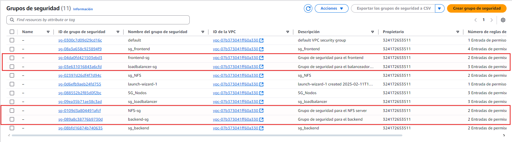

# Practica IAW 4.3

## Implantación de Wordpress en AWS utilizando una arquitectura de tres niveles con AWS SDK para Python

En esta practica vamos a realizar la creacion de la estructura de la [`Practica 1.11 - Implantación de Wordpress en AWS utilizando una arquitectura de tres niveles`](https://github.com/rcazhui1404/practica-iaw-1.11) a traves de una plataforma de computacion en la nube mediante **AWS SDK para Python (Boto3)**.

## ¿Qué es Boto3?

[`Boto3`](https://aws.amazon.com/es/sdk-for-python/) es un SDK (Software Development Kit) de [`Python`](https://www.python.org) desarrollado por y para Amazon Web Services (AWS). Este SDK permite a los desarrolladores interactuar con los servicios de AWS para crear y gestionar recursos como grupos de seguridad o instancias EC2, a través de aplicaciones escritas en [`Python`](https://www.python.org).

## Infraestructura necesaria

La infraestructura propuesta consta de cinco máquinas virtuales, un **balanceador de carga**, una capa **front-end** formada por dos servidores web y un servidor NFS y una ultima capa **back-end** formada por un servidor, cada capa de la infraestrutura tendra su respectivo grupo de seguridad con reglas personalizadas.

Necesitaremos crear las siguientes máquinas virtuales y reglas:

- Balanceador: Acceso por SSH (puerto 22), HTTP (puerto 80) y HTTPS (puerto 443).
- Frontal Web 1: Acceso por SSH (puerto 22) y NFS (puerto 2049).
- Frontal Web 2: Acceso por SSH (puerto 22) y NFS (puerto 2049).
- Servidor NFS: NFS: Acceso por SSH (puerto 22) y NFS (puerto 2049).
- Servidor de Base de Datos: Acceso por SSH (puerto 22) y MySQL (puerto 3306).

## Paso previos a la práctica

### Creación de un entorno virtual para instalar Boto3

Creamos un entorno virtual.

```python
python3 -m venv .venv
```

Activamos el entorno virtual.

```bash
. .venv/bin/activate
```

Instalamos el paquete `boto3`.

```python
python3 -m pip install boto3
```

### Instalación de AWS CLI

Para realizar la instalación de AWS CLI en un sistema operativo Linux sobre una arquitectura x86 de 64 bits, tenemos que ejecutar los siguientes comandos.

**Paso 1.** Descargamos un archivo `.zip` con la aplicación AWS CLI.

```bash
curl "https://awscli.amazonaws.com/awscli-exe-linux-x86_64.zip" -o "awscliv2.zip"
```

**Paso 2.** Descomprimimos el archivo que acabamos de descargar.

```bash
unzip awscliv2.zip
```

**Paso 3.** Ejectuamos el script de instalación.

```bash
sudo ./aws/install
```

**Paso 4.** Comprobamos que la instalación se ha realizado de forma correcta.

```bash
aws --version
```

### Configuración de AWS CLI

Para configurar AWS CLI ejecutaremos el siguiente comando.

```bash
aws configure
```

Este comandos nos preguntará estos datos:

```bash
AWS Access Key ID [None]: 
AWS Secret Access Key [None]: 
Default region name [None]: 
Default output format [None]:
``` 

Y creará un archivo de texto llamado credentials dentro del directorio home del usuario.

- En Linux/macOs el archivo estará en la ruta: `~/.aws/credentials`.
- En Windows estará en la ruta: `C:\Users\usuario\.aws\credentials`.

## Creación y configuracion de grupos de seguridad

Importamos el archivo `aws_resource_functions` y lo renombramos como `aws`

```python
from common import aws_resource_functions as aws
```

### Creamos el grupo de seguridad: frontend-sg

Definimos las reglas del grupo de seguridad y las almacenamos en una variable.

```python
regla_front = [
    {'CidrIp': '0.0.0.0/0', 'IpProtocol': 'tcp', 'FromPort': 22, 'ToPort': 22},
    {'CidrIp': '0.0.0.0/0', 'IpProtocol': 'tcp', 'FromPort': 2049, 'ToPort': 2049}]
```

Definimos el nombre del grupo de seguridad y una descripción y lo almacenamos en una variable.

```python
sg_front_name = "frontend-sg"
sg_front_descrip = "Grupo de seguridad para el frontend"
```

Ejecutamos el siguiente comando para crear el grupo de seguridad.

```python
aws.create_security_group(sg_front_name, sg_front_descrip, regla_front)
```

### Creamos el grupo de seguridad: backend-sg

Definimos las reglas del grupo de seguridad y las almacenamos en una variable.

```python
regla_backend = [
    {'CidrIp': '0.0.0.0/0', 'IpProtocol': 'tcp', 'FromPort': 22, 'ToPort': 22},
    {'CidrIp': '0.0.0.0/0', 'IpProtocol': 'tcp', 'FromPort': 3306, 'ToPort': 3306}]
```

Definimos el nombre del grupo de seguridad y una descripción y lo almacenamos en una variable.

```python
sg_backend_name = "backend-sg"
sg_backend_descrip = "Grupo de seguridad para el backend"
```

Ejecutamos el siguiente comando para crear el grupo de seguridad.

```python
aws.create_security_group(sg_backend_name, sg_backend_descrip, regla_backend)
```

### Creamos el grupo de seguridad: NFS-sg

Definimos las reglas del grupo de seguridad y las almacenamos en una variable.

```python
regla_nfs = [
    {'CidrIp': '0.0.0.0/0', 'IpProtocol': 'tcp', 'FromPort': 22, 'ToPort': 22},
    {'CidrIp': '0.0.0.0/0', 'IpProtocol': 'tcp', 'FromPort': 2049, 'ToPort': 2049}]
```

Definimos el nombre del grupo de seguridad y una descripción y lo almacenamos en una variable.

```python
sg_nfs_name = "NFS-sg"
sg_nfs_descrip = "Grupo de seguridad para el NFS server"
```

Ejecutamos el siguiente comando para crear el grupo de seguridad.

```python
aws.create_security_group(sg_nfs_name, sg_nfs_descrip, regla_nfs)
```

### Creamos el grupo de seguridad: loadbalancer-sg

Definimos las reglas del grupo de seguridad y las almacenamos en una variable.

```python
regla_loadbalancer = [
    {'CidrIp': '0.0.0.0/0', 'IpProtocol': 'tcp', 'FromPort': 22, 'ToPort': 22},
    {'CidrIp': '0.0.0.0/0', 'IpProtocol': 'tcp', 'FromPort': 80, 'ToPort': 80},
    {'CidrIp': '0.0.0.0/0', 'IpProtocol': 'tcp', 'FromPort': 443, 'ToPort': 443}]
```

Definimos el nombre del grupo de seguridad y una descripción y lo almacenamos en una variable.

```python
sg_load_name = "loadbalancer-sg"
sg_load_descrip = "Grupo de seguridad para el balanceador de carga"
```

Ejecutamos el siguiente comando para crear el grupo de seguridad.

```python
aws.create_security_group(sg_load_name, sg_load_descrip, regla_loadbalancer)
```

## Creación y configuracion de las instancias de AWS

Definimos las variables que necesitaremos a la hora de crear la instancias. 

```python
ami = 'ami-04b4f1a9cf54c11d0'
instance_type = 't2.small'
key_name = 'vockey'
```


### Creamos una intancia EC2 para el frontend

Definimos el nombre que tendra la instancia y la almacenamos en una variable.

```python
inst_name_front = 'frontend'
```

Comprobamos que el grupo de seguridad existe para que no haya conflicto.

```python
if aws.security_group_exists(sg_front_name) == False:
    print('The security group does not exist')
    exit()
```

Ejecutamos el siguiente comando para crear la instancia.

```python
aws.create_instance(ami, 1, instance_type, key_name, inst_name_front, sg_front_name)
```

### Creamos una intancia EC2 para el frontend_2

Definimos el nombre que tendra la instancia y la almacenamos en una variable.

```python
inst_name_front2 = 'frontend_2'
```

Comprobamos que el grupo de seguridad existe para que no haya conflicto.

```python
if aws.security_group_exists(sg_front_name) == False:
    print('The security group does not exist')
    exit()
```

Ejecutamos el siguiente comando para crear la instancia.

```python
aws.create_instance(ami, 1, instance_type, key_name, inst_name_front2, sg_front_name)
```

### Creamos una intancia EC2 para el backend

Definimos el nombre que tendra la instancia y la almacenamos en una variable.

```python
inst_name_backend = 'backend'
```

Comprobamos que el grupo de seguridad existe para que no haya conflicto.

```python
if aws.security_group_exists(sg_backend_name) == False:
    print('The security group does not exist')
    exit()
```

Ejecutamos el siguiente comando para crear la instancia.

```python
aws.create_instance(ami, 1, instance_type, key_name, inst_name_backend, sg_backend_name)
```

### Creamos una intancia EC2 para el NFS

Definimos el nombre que tendra la instancia y la almacenamos en una variable.

```python
inst_name_NFS = 'NFS_server'
```

Comprobamos que el grupo de seguridad existe para que no haya conflicto.

```python
if aws.security_group_exists(sg_nfs_name) == False:
    print('The security group does not exist')
    exit()
```

Ejecutamos el siguiente comando para crear la instancia.

```python
aws.create_instance(ami, 1, instance_type, key_name, inst_name_NFS, sg_nfs_name)
```

### Creamos una intancia EC2 para el loadbalancer

Definimos el nombre que tendra la instancia y la almacenamos en una variable.

```python
inst_name_load = 'loadbalancer'
```

Comprobamos que el grupo de seguridad existe para que no haya conflicto.

```python
if aws.security_group_exists(sg_load_name) == False:
    print('The security group does not exist')
    exit()
```

Ejecutamos el siguiente comando para crear la instancia.

```python
aws.create_instance(ami, 1, instance_type, key_name, inst_name_load, sg_load_name)
```

## Comprobación de la creación

Comprobamos que los grupos de seguridad se crearon correctamente en consola.


Comprobamos que los grupos de seguridad se crearon correctamente en en `AWS`.



Comprobamos que las instancias se crearon correctamente en consola.


Comprobamos que las instancia se crearon correctamente en AWS.

