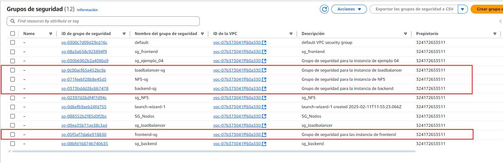
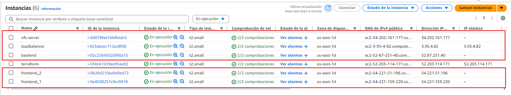

# Practica IAW 4.5

## Implantación de Wordpress en AWS utilizando Terraform

En esta practica vamos a realizar la creacion de la estructura de la [`Practica 1.11 - Implantación de Wordpress en AWS utilizando una arquitectura de tres niveles`](https://github.com/rcazhui1404/practica-iaw-1.11) a traves de una plataforma de computacion en la nube mediante **Terraform**.

## ¿Qué es Terraform?

[Terraform](https://www.terraform.io) es una herramienta de [infraestructura como código](https://es.wikipedia.org/wiki/Infraestructura_como_código) (*Infraestructure as Code, IaC*) que permite crear, modificar y eliminar infraestructura de forma automática.

[Terraform](https://www.terraform.io) puede gestionar los recursos de diferentes proveedores de servicios en la nube, como [AWS](https://aws.amazon.com/es/), [Google Cloud](https://cloud.google.com), [Azure](https://azure.microsoft.com/es-es/), etc.

## Infraestructura necesaria

La infraestructura propuesta consta de cinco máquinas virtuales, un **balanceador de carga**, una capa **front-end** formada por dos servidores web y un servidor NFS y una ultima capa **back-end** formada por un servidor, cada capa de la infraestrutura tendra su respectivo grupo de seguridad con reglas personalizadas.

Necesitaremos crear las siguientes máquinas virtuales y reglas:

- **Balanceador:** Acceso por SSH (puerto 22), HTTP (puerto 80) y HTTPS (puerto 443).

- **Frontal Web 1:** Acceso por SSH (puerto 22) y NFS (puerto 2049).

- **Frontal Web 2:** Acceso por SSH (puerto 22) y NFS (puerto 2049).

- **Servidor NFS:** NFS: Acceso por SSH (puerto 22) y NFS (puerto 2049).

- **Servidor de Base de Datos:** Acceso por SSH (puerto 22) y MySQL (puerto 3306).

## Contenido del archivo de las variables

### Creación de las variables necesarias para la instancia

```
variable "ami_id" {
  description = "Identificador de la AMI"
  type        = string
  default     = "ami-00874d747dde814fa"
}

variable "instance_type" {
  description = "Tipo de instancia"
  type        = string
  default     = "t2.small"
}

variable "key_name" {
  description = "Nombre de la clave pública"
  type        = string
  default     = "vockey"
}

variable "region" {
  description = "Región de AWS donde se creará la instancia"
  type        = string
  default     = "us-east-1"
}
```

### Creación de las variables necesarias para el grupo de seguridad del frontend

```
variable "sg_frontend" {
  description = "Nombre del grupo de seguridad del frontend"
  type        = string
  default     = "frontend-sg"
}

variable "frontend" {
  description = "Puertos de entrada del grupo de seguridad del frontend"
  type        = list(number)
  default     = [22, 2049]
}

variable "sg_des_front" {
  description = "Descripción del grupo de seguridad del frontend"
  type        = string
  default     = "Grupo de seguridad para las instancia de frontend"
}
```

### Creamos las variables necesarias para la creación de la instancias.

```
variable "instance_frontend" {
  description = "Nombre de la instancia del frontend"
  type        = string
  default     = "frontend_1"
}

variable "instance_frontend_2" {
  description = "Nombre de la instancia del frontend"
  type        = string
  default     = "frontend_2"
}
```

### Creación de las variables necesarias para el grupo de seguridad del loadbalancer

```
variable "sg_loadbalancer" {
  description = "Nombre del grupo de seguridad del loadbalancer"
  type        = string
  default     = "loadbalancer-sg"
}

variable "loadbalancer" {
  description = "Puertos de entrada del grupo de seguridad del loadbalancer"
  type        = list(number)
  default     = [22, 80, 443]
}

variable "sg_des_load" {
  description = "Descripción del grupo de seguridad del loadbalancer"
  type        = string
  default     = "Grupo de seguridad para la instancia de loadbalancer"
}
```

### Creamos la variable necesaria para la creación de la instancia

```
variable "instance_loadbalancer" {
  description = "Nombre de la instancia del loadbalancer"
  type        = string
  default     = "loadbalancer"
}
```

### Creación las variables necesarias para el grupo de seguridad del backend

```
variable "sg_backend" {
  description = "Nombre del grupo de seguridad del backend"
  type        = string
  default     = "backend-sg"
}

variable "backend" {
  description = "Puertos de entrada del grupo de seguridad del backend"
  type        = list(number)
  default     = [22, 3306]
}

variable "sg_des_back" {
  description = "Descripción del grupo de seguridad del backend"
  type        = string
  default     = "Grupo de seguridad para la instancia de backend"
}
```

### Creamos la variable necesaria para la creación de la instancia

```
variable "instance_backend" {
  description = "Nombre de la instancia del backend"
  type        = string
  default     = "backend"
}
```

### Creación las variables necesarias para el grupo de seguridad del NFS-Server

```
variable "sg_nfs" {
  description = "Nombre del grupo de seguridad del NFS-server"
  type        = string
  default     = "NFS-sg"
}

variable "nfs" {
  description = "Puertos de entrada del grupo de seguridad del nfs"
  type        = list(number)
  default     = [22, 2049]
}

variable "sg_des_nfs" {
  description = "Descripción del grupo de seguridad del NFS"
  type        = string
  default     = "Grupo de seguridad para la instancia de NFS"
}
```

### Creamos la variable necesaria para la creación de la instancia

```
variable "instance_nfs" {
  description = "Nombre de la instancia del NFS"
  type        = string
  default     = "nfs-server"
}
```

## Creación y configuración de los frontend

Creamos el grupo de seguridad del frontend.

```
resource "aws_security_group" "frontend-sg" {
  name        = var.sg_frontend
  description = var.sg_des_front
}
```

Creamos las reglas de entrada del grupo de seguridad. Utilizamos un bucle para recorrer la lista de puertos definida como variable

```
resource "aws_security_group_rule" "ingress_frontend" {
  security_group_id = aws_security_group.frontend-sg.id
  type              = "ingress"

  count       = length(var.frontend)
  from_port   = var.frontend[count.index]
  to_port     = var.frontend[count.index]
  protocol    = "tcp"
  cidr_blocks = ["0.0.0.0/0"]
}
```

Creamos las reglas de salida del grupo de seguridad.

```
resource "aws_security_group_rule" "egress_frontend" {
  security_group_id = aws_security_group.frontend-sg.id
  type              = "egress"

  from_port   = 0
  to_port     = 0
  protocol    = "-1"
  cidr_blocks = ["0.0.0.0/0"]
}
```

Creamos una instancia EC2 para el frontend 1.

```
resource "aws_instance" "instancia_frontend" {
  ami             = var.ami_id
  instance_type   = var.instance_type
  key_name        = var.key_name
  security_groups = [aws_security_group.frontend-sg.name]

  tags = {
    Name = var.instance_frontend
  }
}
```

Creamos una instancia EC2 para el frontend 2.

```
resource "aws_instance" "instancia_frontend_2" {
  ami             = var.ami_id
  instance_type   = var.instance_type
  key_name        = var.key_name
  security_groups = [aws_security_group.frontend-sg.name]

  tags = {
    Name = var.instance_frontend_2
  }
}
```

## Creación y configuración del loadbalancer

Creamos el grupo de seguridad del loadbalancer

```
resource "aws_security_group" "loadbalancer-sg" {
  name        = var.sg_loadbalancer
  description = var.sg_des_load
}
```

Creamos las reglas de entrada del grupo de seguridad del loadbalancer. Utilizamos un bucle para recorrer la lista de puertos definida como variable

```
resource "aws_security_group_rule" "ingress_loadbalancer" {
  security_group_id = aws_security_group.loadbalancer-sg.id
  type              = "ingress"

  count       = length(var.loadbalancer)
  from_port   = var.loadbalancer[count.index]
  to_port     = var.loadbalancer[count.index]
  protocol    = "tcp"
  cidr_blocks = ["0.0.0.0/0"]
}
```

Creamos las reglas de salida del grupo de seguridad.

```
resource "aws_security_group_rule" "egress_loadbalancer" {
  security_group_id = aws_security_group.loadbalancer-sg.id
  type              = "egress"

  from_port   = 0
  to_port     = 0
  protocol    = "-1"
  cidr_blocks = ["0.0.0.0/0"]
}
```

Creamos una instancia EC2 para el loadbalancer.

```
resource "aws_instance" "instancia_loadbalancer" {
  ami             = var.ami_id
  instance_type   = var.instance_type
  key_name        = var.key_name
  security_groups = [aws_security_group.loadbalancer-sg.name]

  tags = {
    Name = var.instance_loadbalancer
  }
}
```

Creamos una IP elástica y la asociamos a la instancia

```
resource "aws_eip" "ip_elastica" {
  instance = aws_instance.instancia_loadbalancer.id
}
```

## Creación y configuración del backend

Creamos el grupo de seguridad del backend

```
resource "aws_security_group" "backend-sg" {
  name        = var.sg_backend
  description = var.sg_des_back
}
```

Creamos las reglas de entrada del grupo de seguridad del backend. Utilizamos un bucle para recorrer la lista de puertos definida como variable

```
resource "aws_security_group_rule" "ingress_backend" {
  security_group_id = aws_security_group.backend-sg.id
  type              = "ingress"

  count       = length(var.backend)
  from_port   = var.backend[count.index]
  to_port     = var.backend[count.index]
  protocol    = "tcp"
  cidr_blocks = ["0.0.0.0/0"]
}
```

Creamos las reglas de salida del grupo de seguridad.

```
resource "aws_security_group_rule" "egress_backend" {
  security_group_id = aws_security_group.backend-sg.id
  type              = "egress"

  from_port   = 0
  to_port     = 0
  protocol    = "-1"
  cidr_blocks = ["0.0.0.0/0"]
}
```

Creamos una instancia EC2 para el backend

```
resource "aws_instance" "instancia_backend" {
  ami             = var.ami_id
  instance_type   = var.instance_type
  key_name        = var.key_name
  security_groups = [aws_security_group.backend-sg.name]

  tags = {
    Name = var.instance_backend
  }
}
```

## Creación y configuración del NFS-Server

Creamos el grupo de seguridad del NFS

```
resource "aws_security_group" "NFS-sg" {
  name        = var.sg_nfs
  description = var.sg_des_nfs
}
```

Creamos las reglas de entrada del grupo de seguridad del NFS. Utilizamos un bucle para recorrer la lista de puertos definida como variable

```
resource "aws_security_group_rule" "ingress_nfs" {
  security_group_id = aws_security_group.NFS-sg.id
  type              = "ingress"

  count       = length(var.nfs)
  from_port   = var.nfs[count.index]
  to_port     = var.nfs[count.index]
  protocol    = "tcp"
  cidr_blocks = ["0.0.0.0/0"]
}
```

Creamos las reglas de salida del grupo de seguridad.

```
resource "aws_security_group_rule" "egress_nfs" {
  security_group_id = aws_security_group.NFS-sg.id
  type              = "egress"

  from_port   = 0
  to_port     = 0
  protocol    = "-1"
  cidr_blocks = ["0.0.0.0/0"]
}
```

Creamos una instancia EC2 para el nfs

```
resource "aws_instance" "instancia_nfs_server" {
  ami             = var.ami_id
  instance_type   = var.instance_type
  key_name        = var.key_name
  security_groups = [aws_security_group.NFS-sg.name]

  tags = {
    Name = var.instance_nfs
  }
}
```

## Comprobaciones del funcionamiento

Comprobamos que se ejecuta correctamente


Comprobamos que se han creado correctamento los grupos en AWS.



Comprobamos que se han creado correctamento las instancias en AWS.

