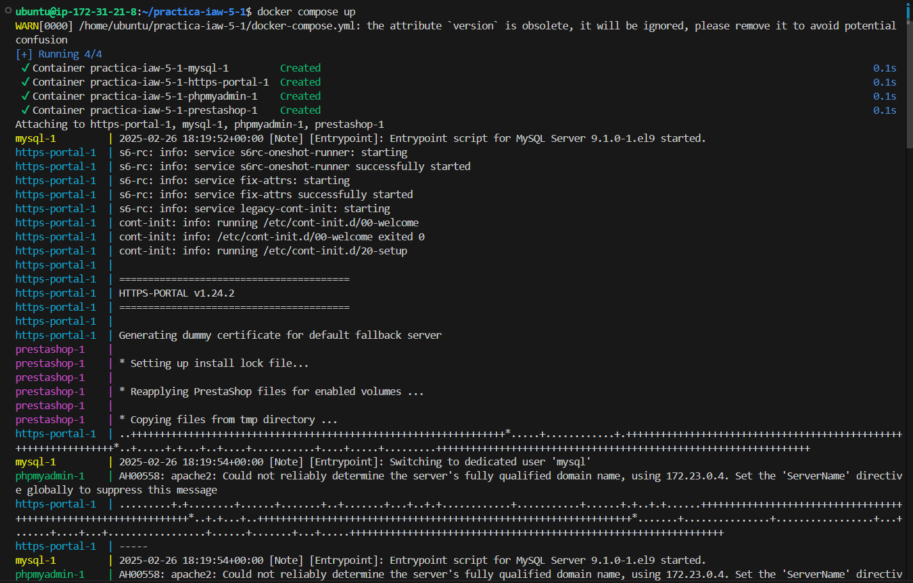
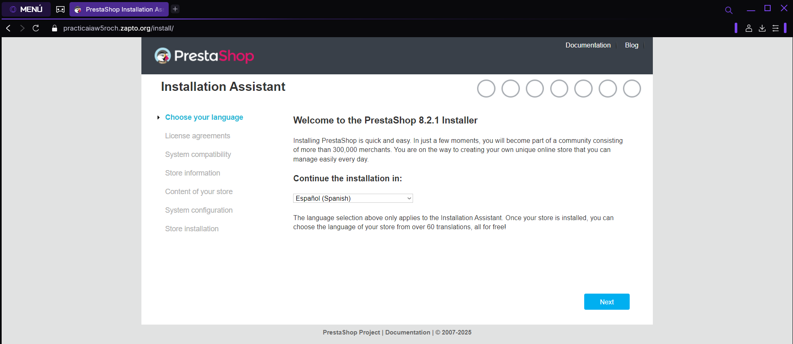
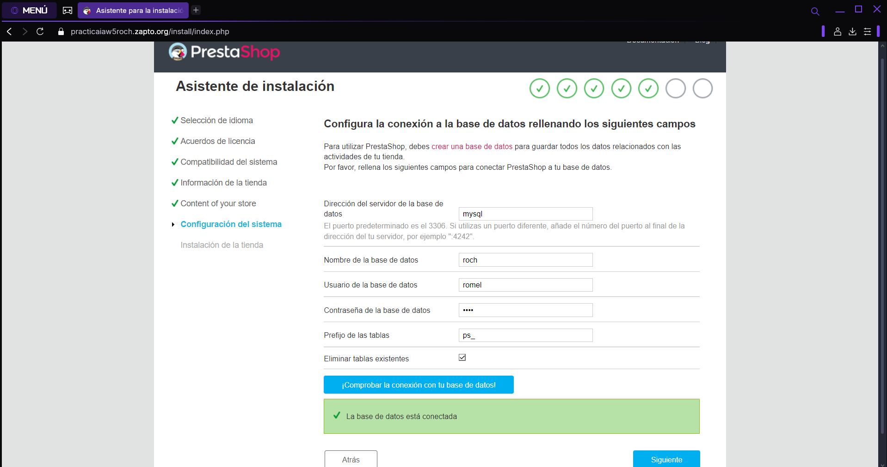
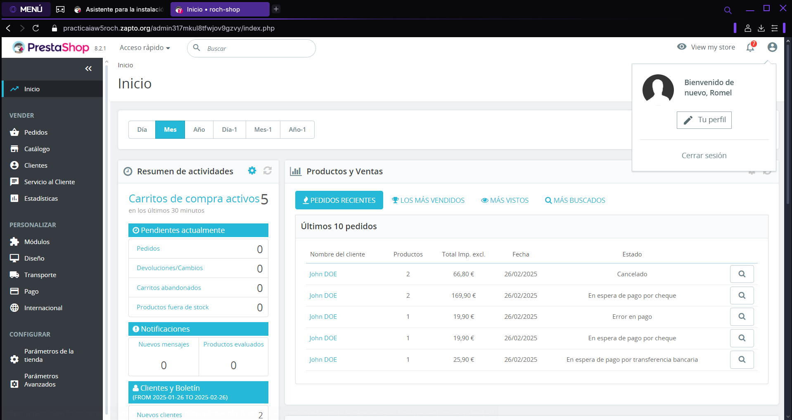
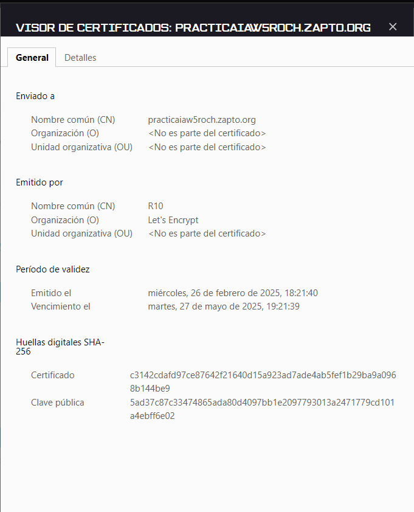

# Practica iaw 5.1

# HTTPS con Let’s Encrypt, Docker y Docker Compose

En esta práctica vamos a habilitar el protocolo [HTTPS](https://es.wikipedia.org/wiki/Protocolo_seguro_de_transferencia_de_hipertexto) en un sitio web [PrestaShop](https://wordpress.org) que se estará ejecutando sobre contenedores Docker en una instancia EC2 de [Amazon Web Services (AWS)](https://aws.amazon.com/es/ec2/).

## ¿Qué es HTTPS?

[HTTPS](https://es.wikipedia.org/wiki/Protocolo_seguro_de_transferencia_de_hipertexto) (Hyptertext Transfer Protocol Secure) o protocolo seguro de transferencia de hipertexto, es un protocolo de la capa de aplicación basado en el protocolo HTTP, destinado a la transferencia segura de datos de hipertexto.

Para poder habilitar el protocolo HTTPS en un sitio web es necesario obtener un **certificado de seguridad**. Este certificado tiene que ser emitido por una **autoridad de certificación** (AC). En esta práctica vamos a obtener un certificado para un dominio de la Autoriidad de Certificación [Let’s Encrypt](https://letsencrypt.org)​.

## ¿Qué es Let’s Encrypt?

[Let’s Encrypt](https://letsencrypt.org)​ es una autoridad de certificación que se puso en marcha el 12 de abril de 2016 y que proporciona [certificados X.509](https://es.wikipedia.org/wiki/X.509) gratuitos para el cifrado de seguridad de nivel de transporte ([TLS](https://es.wikipedia.org/wiki/Seguridad_de_la_capa_de_transporte)) a través de un proceso automatizado diseñado para eliminar el complejo proceso actual de creación manual, la validación, firma, instalación y renovación de los certificados de sitios web seguros.

## ¿Qué es el protocolo ACME?

Para poder obtener un certificado de [Let’s Encrypt](https://letsencrypt.org)​ para un dominio de un sitio web es necesario demostrar que se tiene control sobre ese dominio. Para realizar esta tarea es necesario utilizar un cliente del [protocolo ACME (Automated Certificate Management Environment)](https://en.wikipedia.org/wiki/Automatic_Certificate_Management_Environment).

## ¿Qué es HTTPS-PORTAL?

[HTTPS-PORTAL](https://hub.docker.com/r/steveltn/https-portal/) es una imagen [Docker](https://www.docker.com) que contiene un servidor HTTPS totalmente automatizado que hace uso de las tecnologías [Nginx](https://nginx.org/en/) y [Let’s Encrypt](https://letsencrypt.org). Los certificados SSL se obtienen y renuevan de Let’s Encrypt automáticamente.

Esta imagen está preparada para permitir que cualquier aplicación web pueda ejecutarse a través de [HTTPS](https://es.wikipedia.org/wiki/Protocolo_seguro_de_transferencia_de_hipertexto) con una configuración muy sencilla.

Puede encontrar más información sobre [HTTPS-PORTAL](https://hub.docker.com/r/steveltn/https-portal/) en la web oficial de [Docker Hub](https://hub.docker.com/r/steveltn/https-portal/).

## Contenido del docker-compose-yml

### Creación del contenedor de mysql

Estructura del contenedor de mysql

```
mysql:
    env_file:
      - .env
    image: mysql:9.1
    ports: 
      - 3306:3306
    environment: 
      - MYSQL_ROOT_PASSWORD=${MYSQL_ROOT_PASSWORD}
      - MYSQL_DATABASE=${MYSQL_DATABASE}
      - MYSQL_USER=${MYSQL_USER}
      - MYSQL_PASSWORD=${MYSQL_PASSWORD}
    volumes: 
      - mysql_data:/var/lib/mysql
    networks: 
      - backend-network
    restart: always
```

### Creación del contenedor de phpMyAdmin

Estructura del contenedor de phpMyAdmin

```
  phpmyadmin:
    image: phpmyadmin:5.2.1
    ports:
      - 8080:80
    environment: 
      - PMA_ARBITRARY=1
    networks: 
      - backend-network
      - frontend-network
    restart: always
    depends_on: 
      - mysql
```

### Creación del contenedor de Prestashop

Estructura del contenedor de Prestashop

```
  prestashop:
    image: prestashop/prestashop:8
    environment: 
      - DB_SERVER=mysql
    volumes:
      - prestashop_data:/var/www/html
    networks: 
      - backend-network
      - frontend-network
    restart: always
    depends_on: 
      - mysql
```

### Creación del contenedor de https-portal

Estructura del contenedor de https-portal

```
  https-portal:
    image: steveltn/https-portal:1
    ports:
      - 80:80
      - 443:443
    restart: always
    environment:
      DOMAINS: "${DOMAIN} -> http://prestashop:80"
      STAGE: 'production' # Don't use production until staging works
      # FORCE_RENEW: 'true'
    networks:
      - frontend-network
```

## Comprobaciones del funcionamiento

Comprobamos que se ejecuta correctamente `docker-compose.yml`.



Comprobamos que la página de prestashop funciona correctamente.




Comprobamos que la página de prestashop se conecta a la base de datos.




Comprobamos que tenemos acceso a panel de administrador de Prestashop.




Comprobamos el certificado de la página web.


