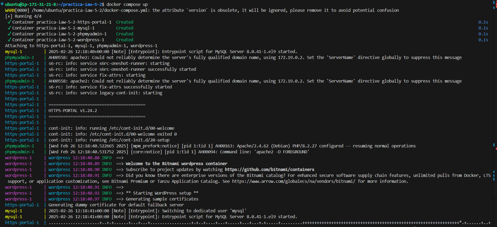
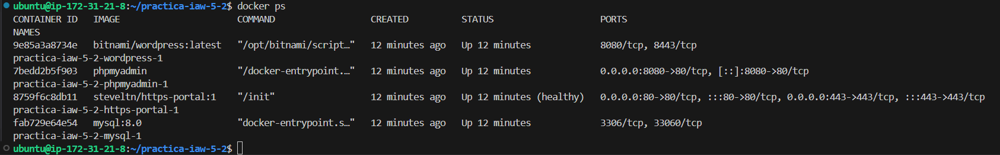
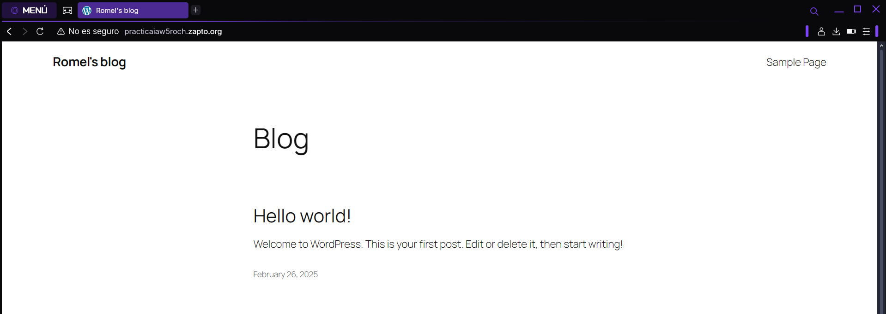
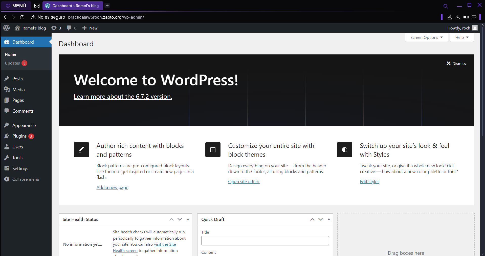
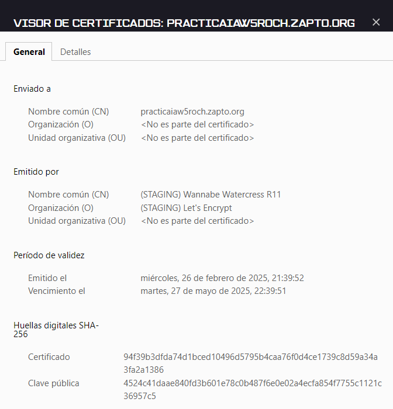
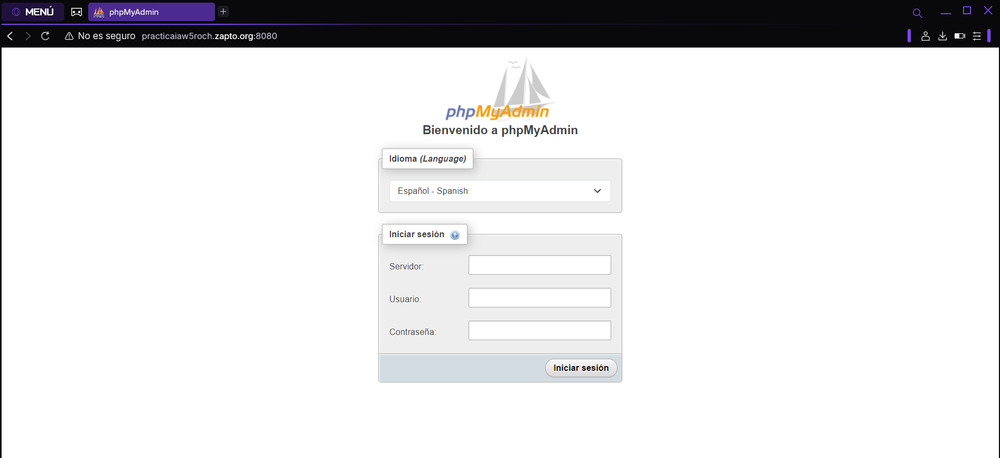

# Practica iaw 5.2

# Despliegue de WordPress usando contenedores Docker y Docker Compose

En esta práctica tendremos que realizar la implantación de un sitio [WordPress](https://wordpress.org) en [Amazon Web Services (AWS)](https://aws.amazon.com/es/ec2/) haciendo uso de contenedores [Docker](https://www.docker.com) y la herramienta [Docker Compose](https://docs.docker.com/compose/).

## Contenido del docker-compose-yml

Estructura del contenedor de mysql.

```
mysql:
    env_file:
      - .env
    image: mysql:8.0
    environment:
      - MYSQL_ROOT_PASSWORD=${MYSQL_ROOT_PASSWORD}
      - MYSQL_DATABASE=${WORDPRESS_DB_NAME}
      - MYSQL_USER=${WORDPRESS_DB_USER}
      - MYSQL_PASSWORD=${WORDPRESS_DB_PASSWORD}
    volumes:
      - mysql_data:/var/lib/mysql
    networks:
        - backend-network
    restart: always
    healthcheck:
      test: ["CMD", "mysqladmin", "ping", "-h", "localhost"]
      interval: 10s
      timeout: 5s
      retries: 3  
```

Estructura del contenedor de phpmyadmin.

```
  phpmyadmin:
    image: phpmyadmin
    ports:
      - 8080:80
    environment: 
      - PMA_ARBITRARY=1
    networks:
      - backend-network
    restart: always
```

Estructura del contenedor de wordpress.

  ```
  wordpress:
    env_file:
      - .env
    image: bitnami/wordpress:latest
    environment:
      - DB_SERVER=mysql
      - WORDPRESS_DATABASE_USER=${WORDPRESS_DB_USER}
      - WORDPRESS_DATABASE_NAME=${WORDPRESS_DB_NAME}
      - WORDPRESS_DATABASE_PASSWORD=${WORDPRESS_DB_PASSWORD}
      - WORDPRESS_DATABASE_HOST=mysql
      - WORDPRESS_DATABASE_PORT_NUMBER=3306
    volumes:
      - wordpress:/var/www/html
    networks:
      - backend-network
      - frontend-network
    restart: always
    depends_on:
      - mysql
  ```

Estructura del contenedor de https-portal.

```
  https-portal:
    image: steveltn/https-portal:1
    ports:
      - 80:80
      - 443:443
    restart: always
    environment:
      DOMAINS: "${DOMAIN} -> http://wordpress:8080"
      stage: 'production'
    networks:
      - frontend-network
```


## Comprobaciones del funcionamiento

Comprobamos que se ejecuta correctamente `docker-compose.yml`.



Comprobamos el estado de los contenedores.


Comprobamos que la página de Wordpress funciona correctamente.



Comprobamos que tenemos acceso a panel de administrador de Prestashop.



Comprobamos el certificado de la página web.



Comprobamos que la página de phpMyAdmin funciona correctamente.

