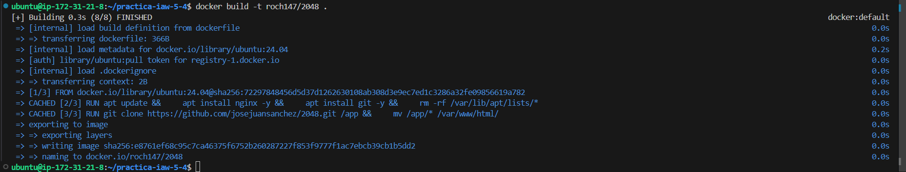
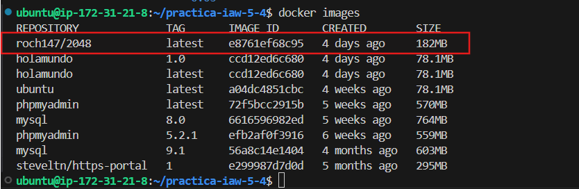
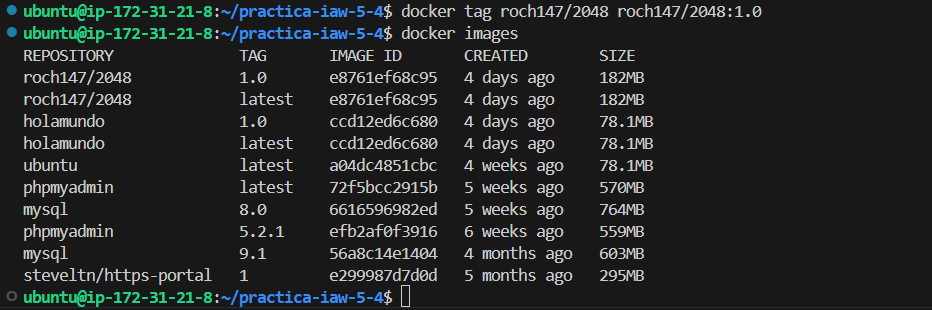
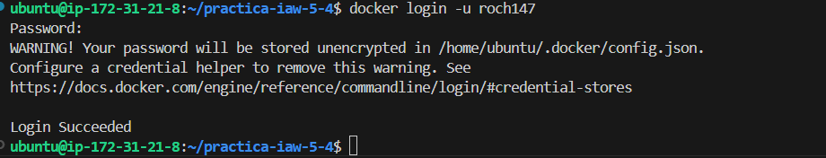
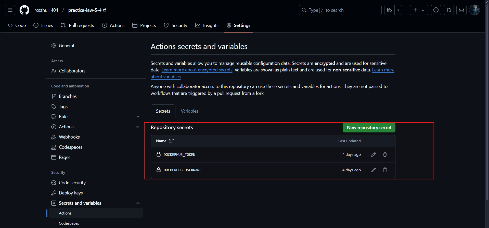
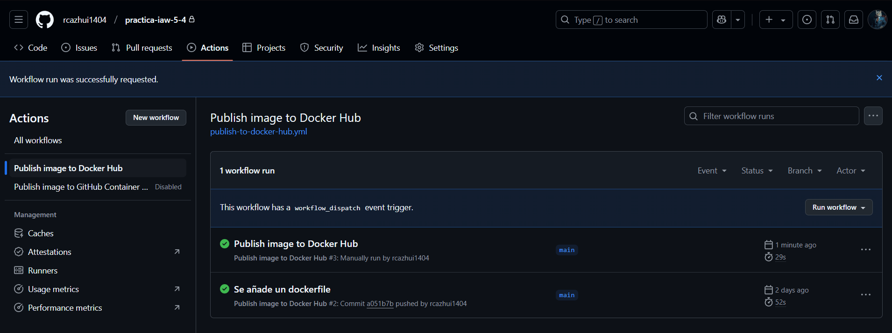
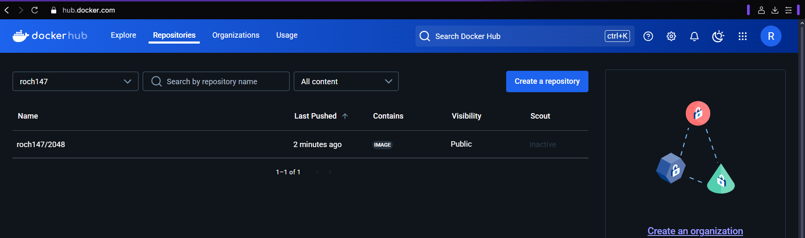
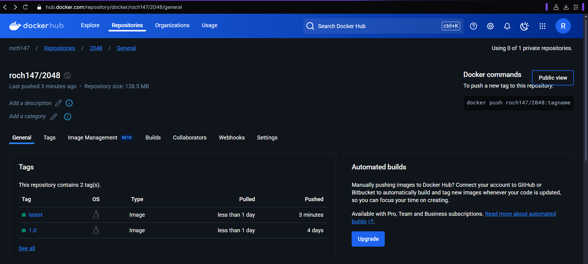
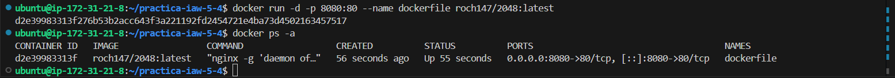
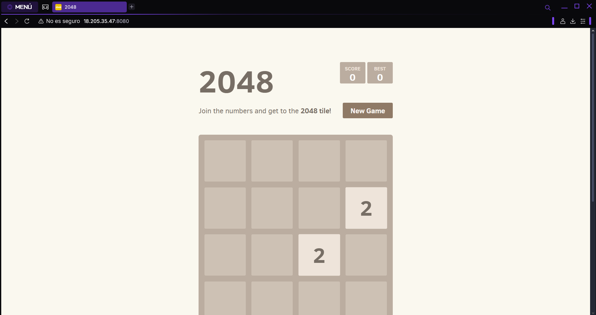

# Práctica IAW 5.4

# «Dockerizar» una web estática y publicarla en Docker Hub

En esta práctica tendremos que crear un archivo [Dockerfile](https://docs.docker.com/reference/dockerfile/) para crear una imagen [Docker](https://www.docker.com) que contenga una **aplicación web estática**. Posteriormente deberá publicar la imagen en [Docker Hub](https://hub.docker.com) y realizar la implantación del sitio web en [Amazon Web Services (AWS)](https://aws.amazon.com/es/ec2/) haciendo uso de contenedores [Docker](https://www.docker.com) y de la herramienta [Docker Compose](https://docs.docker.com/compose/).

## Contenido del dockerfile

Se ha desarrollado un archivo `Dockerfile` que cumple con los requisitos establecidos para el despliegue de la aplicación web estática en un contenedor Docker.

```
FROM ubuntu:24.04

RUN apt update && \
    apt install nginx -y && \
    apt install git -y && \
    rm -rf /var/lib/apt/lists/*

RUN git clone https://github.com/josejuansanchez/2048.git /app && \
    mv /app/* /var/www/html/

CMD [ "nginx", "-g", "daemon off;" ]

LABEL AUTHOR="Romel"
LABEL DESCRIPTION="Imagen de ejemplo"
```

## Creación de la imagen Docker a partir del archivo Dockerfile

Para crear la imagen de Docker a partir del archivo Dockerfile deberá ejecutar el siguiente comando.

```
docker build -t roch147/2048 .
```

Para comprobar que la imagen se ha creado correctamente podemos ejecutar el comando:

```
docker images
```

Asignamos una etiqueta a la imagen.

```
docker tag roch147/2048 roch147/2048:1.0
```

### Comprobaciones del funcionamiento.

Comprobación de que el comando se ejecuta correctamente.



Comprobación de que se crea correctamente la imagen.



Comprobación de que se asigna una etiqueta correctamente.



## Publicar la imagen en Docker Hub

Tendremos que iniciar sesión en Docker Hub con el comando.

```
docker login -u roch147
```

Una vez que hayamos iniciado sesion podemos publicar la imagen con el comando docker push.

```
docker push roch147/2048
```

### Comprobaciones del funcionamiento.

Comprobación de que nos podemos logear correctamente.



Comprobación de que podemos publicar la imagen.


## Publicar la imagen automáticamente en Docker Hub con GitHub Actions

En este apartado vamos a aprender cómo podemos configurar [GitHub Actions](https://docs.github.com/es/actions) para publicar una imagen automáticamente en un Registry como Docker Hub, cada vez que se realice un push al repositorio de GitHub.

Podemos encontrar un ejemplo de cómo se puede configurar GitHub Actions para publicar una imagen de Docker en el siguiente repositorio de GitHub:

- https://github.com/josejuansanchez/2048-github-actions

Se deberá crear dos *secrets* en el repositorio para las acciones de GitHub Actions. Estos *secrets* almacenarán los siguientes valores:

- `DOCKERHUB_USERNAME`: Nombre de usuario en Docker Hub.
- `DOCKERHUB_TOKEN`: Token de acceso a Docker Hub, que tendrá que crear en la sección de Security de su cuenta de Docker Hub.

## Comprobaciones

Comprobación de las varibales creadas.



Comprobación de que funciona correctamente.



Comprobación de que se publicó en docker hub.



Comprobación de las versiones que se han publicado en docker hub.



Comprobación de que se puede ejecutar correctamente.



Comprobación de que la página web funciona correctamente.

